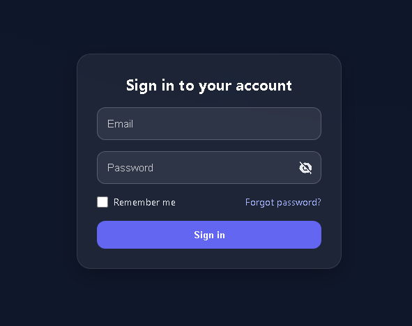

# Login-page-practice
A simple login form with a show/hide password feature built using pure HTML, CSS, and JavaScript.

# Password Toggle Form 🔒

A simple login form with a show/hide password feature using HTML, CSS, and JavaScript.

---

## 📸 Preview

---

## 💻 Files included
- **index.html** – Structure of the form  
- **main.css** – Glassmorphism style and layout  
- **app.js** – Logic for show/hide password  

---

## 🚀 How to use
1. Download or clone this repository  
2. Open `index.html` in your browser  
3. Click the eye icon to toggle password visibility  

---

Made with ❤️ using pure HTML, CSS & JavaScript.
